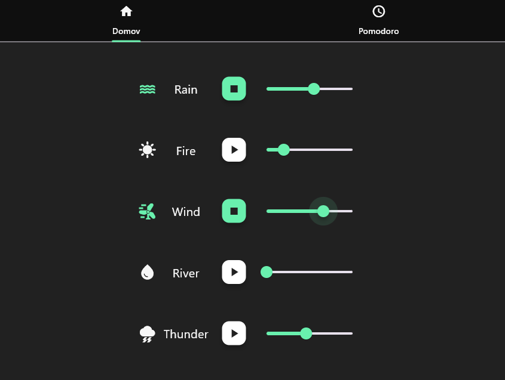
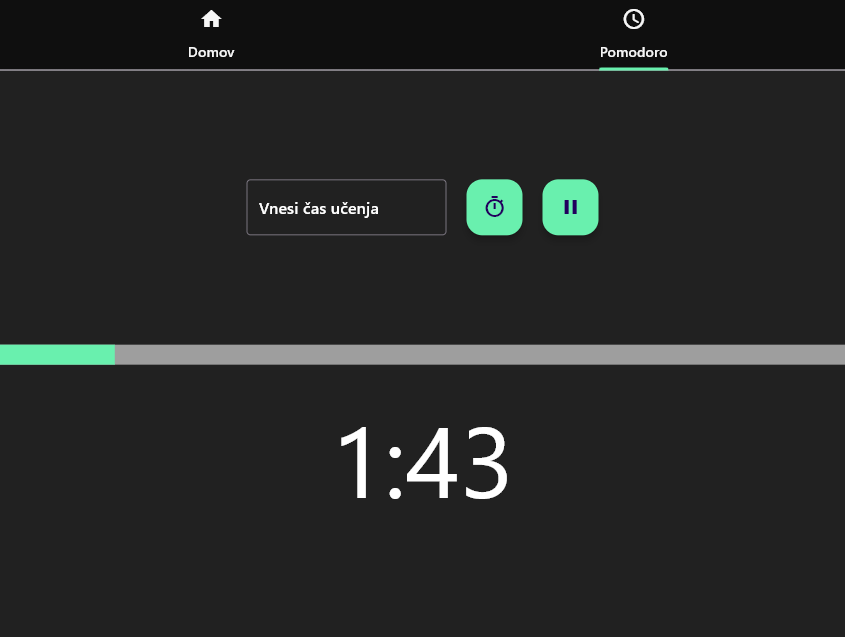

# SoundFocus - Your Relaxation Companion

## Description

Relaxify is a Flutter application designed to create a soothing environment by playing background noises like rain and other relaxing sounds. Developed as a learning project for both Flutter and relaxation, this app provides a simple interface to toggle background noises on and off. Additionally, it features a built-in Pomodoro timer to help users enhance focus and productivity during work or study sessions.

## Screenshots

## Features

- **Background Noises**: Toggle soothing background noises on and off for a relaxed atmosphere.
- **Pomodoro Timer**: Built-in Pomodoro timer to enhance focus during work or study sessions.
